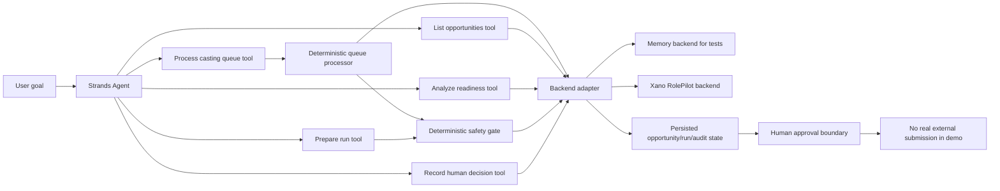

# Architecture

## Goal
RolePilot Agent automates casting application preparation while keeping consequential external action behind an explicit human boundary.

## Why two control layers
The Strands agent decides which product tools to call and in what order. For full-inbox delegation it can call `process_casting_queue`, which processes every opportunity, prepares safe work, isolates per-opportunity failures, and returns only unresolved decision points plus an execution trace. Deterministic product rules separately decide whether any opportunity is preparable. This keeps autonomous orchestration useful without making model output the source of authority for consequential state transitions.

## Current tool contract
- `list_casting_opportunities`: load the queue.
- `analyze_casting_opportunity`: classify readiness.
- `prepare_application_run`: persist preparation only if the safety gate allows it.
- `process_casting_queue`: autonomously process the full queue, persist safe READY work, isolate failed lanes, and surface only human decision points with an auditable trace.
- `record_human_decision`: persist an internal demo decision without external submission.

## Backends
### MemoryBackend
Synthetic, deterministic, credential-free backend for tests and offline smoke runs. It contains three competition-safe scenarios: READY, NEEDS_RECORDING, and REVIEW.

### XanoBackend
Adapter for the RolePilot Xano prototype created on 2026-09-03. It uses the prototype REST APIs for opportunities, analysis, application runs, and approval state.

## Security and privacy
- No final casting submission tool exists in this repository.
- No AWS credentials or Xano secrets are committed.
- Tests require no paid model calls.
- Public demo data must remain synthetic.
